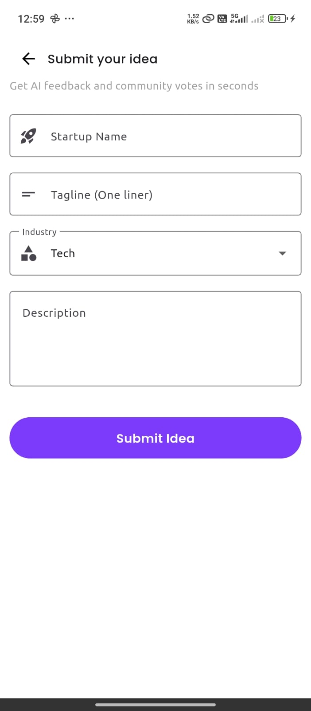
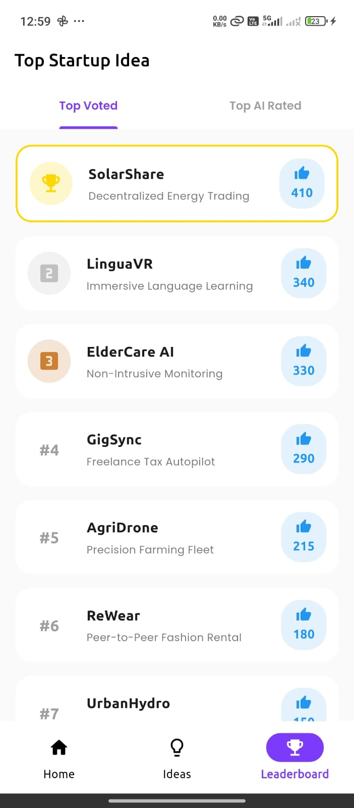

# 🚀 Startup Scout - The Startup Idea Evaluator

**"From Spark to Startup – Validating Ideas Instantly"**

Startup Scout is a mobile application designed to help early-stage entrepreneurs pitch, track, and validate their startup concepts. It acts as a "pocket validator," offering a clean, distraction-free environment to organize ideas, simulate AI feedback, and share pitches with the world.

---


## 📱 App Screenshots

| Home | Submit Idea | Leaderboard |
|------|-------------|-------------|
|  |  |  |


## ✨ Key Features

* **🧠 Smart Onboarding:** Context-aware entry flow that appears only for new users and remembers your progress via local storage.
* **📝 Idea Submission Engine:** A validated form to capture Startup Name, Tagline, Category, and Description.
* **📊 Interactive Dashboard:** Real-time list view of all your submitted ideas.
* **🔄 Swipe Gestures:**
    * **Swipe Right:** Instantly **Share** your pitch via WhatsApp, Slack, or Email using native integrations.
    * **Swipe Left:** **Delete** an idea (includes a safety confirmation dialog to prevent accidents).
* **💾 Offline Persistence:** Built with an offline-first architecture using `GetStorage`. Your ideas are saved locally and persist across app restarts.
* **🎨 Responsive Design:** Optimized for various screen sizes using `flutter_screenutil`.

---

## 🛠️ Tech Stack

* **Framework:** Flutter (Dart)
* **State Management:** [GetX](https://pub.dev/packages/get) (Separation of Business Logic & UI)
* **Local Storage:** [GetStorage](https://pub.dev/packages/get_storage) (High-performance key-value store)
* **Native Integration:** [share_plus](https://pub.dev/packages/share_plus) (Platform-specific sharing)
* **Typography:** Google Fonts (Ubuntu)
* **Responsiveness:** flutter_screenutil

---

## 📂 Project Architecture

The project follows a clean **MVC (Model-View-Controller)** structure to ensure scalability and maintainability.

```text
lib/
├── controllers/      # Business logic (Splash, Onboarding, Submission)
├── models/           # Data models (IdeaModel with JSON serialization)
├── routes/           # AppRoutes and AppPages definitions
├── utils/            # Constants, Colors, and Helper functions
├── views/            # UI Screens (Onboarding, Home, Form)
│   └── widgets/      # Reusable components (WgListTile, WgButton)
└── main.dart         # App Entry point
```
🚀 How to Run the Project
Follow these steps to get the app running on your local machine.

Prerequisites
Flutter SDK installed (Installation Guide)

Android Studio or VS Code set up

An Android Emulator or Physical Device

Installation Steps
Clone the Repository

git clone https://github.com/kapilpatel1011/startupscout.git
cd startup-scout

Install Dependencies

flutter pub get

Run the App Connect your device/emulator and run:
flutter run

Install APK (For Non-Developers)
If you do not have the Flutter SDK installed, you can simply install the app on an Android device:

 📥 Download App

You can download and install the APK from the link below:

🔗[Download Startup Scout APK](https://drive.google.com/file/d/1qNMl6LWgORv3z2EoQIko3Y3OgPX8APMb/view?usp=sharing)

⚠️ Note: Enable "Install from Unknown Sources" to install the app.

👨‍💻 Author
Kapil Patel

Role: Flutter Developer

Focus: Building scalable, user-centric mobile applications.

"Building products that solve real problems."
